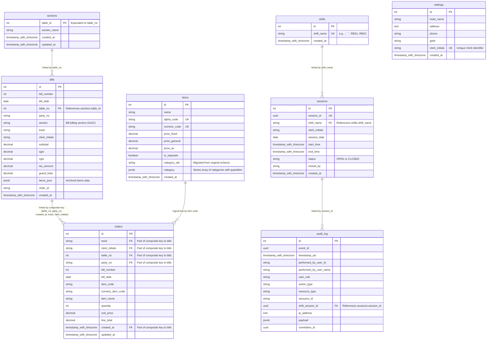

# Restaurant Billing System - ER Diagram

This diagram represents the final database schema after applying the initial creation script and all subsequent updates (Update-1, Update-2, and Update-3).

## Key Relationships & Constraints

1.  **Bills & Sections**: Every bill is associated with a specific table/section via the `table_no` (FK to `sections.table_id`).
2.  **Orders & Bills**: In the final schema (Update-3), orders are linked to bills using a composite foreign key consisting of `(table_no, party_no, created_at, track, clerk_initials)`. This ensures precise tracking of orders related to a specific billing instance.
3.  **Shifts & Sessions**: The `sessions` table tracks individual instances of shifts. Each session belongs to a predefined shift type in the `shifts` table.
4.  **Audit Logs**: All system events in the `audit_log` are optionally linked to a specific `session_id` to track actions during a particular shift.
5.  **Settings**: Global configuration and the unique clerk identifier are managed here.
6.  **Items**: The menu items include both alpha and numeric codes for quick entry, and support a complex category structure via JSONB (Update-1) to handle item components (e.g., an "Idli Vada" plate containing 1 Idli and 1 Vada).
