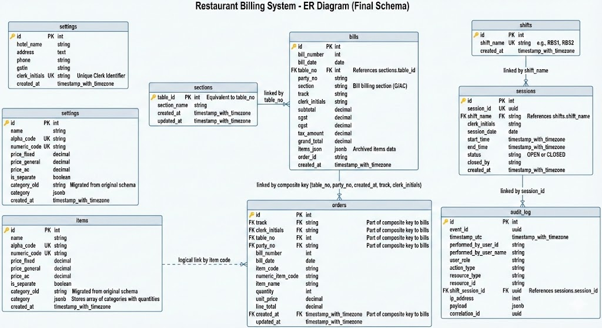

# Restaurant Billing Application

This is a restaurant billing application built using the PERN stack (PostgreSQL, Express, React, Node.js). The application allows users to manage billing records efficiently.

## Project Structure

```text
restaurant-billing-app
├── backend
│   ├── migrations                 # Database migration scripts
│   ├── src
│   │   ├── app.js                 # Main entry point for the backend server
│   │   ├── db
│   │   │   └── index.js           # PostgreSQL database connection setup
│   │   ├── models
│   │   │   ├── billingModel.js    # Handles database queries for bills
│   │   │   ├── userModel.js       # Handles database queries for users
│   │   │   ├── shiftModel.js      # Handles database queries for shifts
│   │   │   ├── itemModel.js       # Handles database queries for items
│   │   │   ├── pricingModel.js    # Handles database queries for item pricing
│   │   │   ├── transactionModel.js# Handles database queries for transactions
│   │   │   └── invoiceModel.js    # Handles database queries for invoices
│   │   ├── controllers
│   │   │   ├── billingController.js
│   │   │   ├── userController.js
│   │   │   ├── shiftController.js
│   │   │   ├── itemController.js
│   │   ├── routes
│   │   │   ├── billingRoutes.js
│   │   │   ├── userRoutes.js
│   │   │   ├── shiftRoutes.js
│   │   │   ├── itemRoutes.js
│   ├── .env                       # Backend environment variables
│   ├── package.json
├── frontend
│   ├── public                     # Static assets
│   ├── src                        # Frontend source code (React)
│   ├── .env                       # Frontend environment variables
│   ├── package.json
├── dbscrpt.txt                    # Full database creation and update scripts
├── ER_Diagram.md                  # Detailed ER diagram documentation
├── docker-compose.yml             # Docker configuration
└── README.md                      # Project documentation
```

## Database Design

### Entity Relationship Diagram (ERD)

The following diagram illustrates the database schema and relationships after the final updates.

![Database ER Diagram]


> Note: The image above is a generated preview of the Mermaid diagram.

#### Table Relationships:

- **Sections** (`tables`): Master table for restaurant sections/tables.
- **Bills**: Linked to `sections` via `table_no`.
- **Orders**: Linked to `bills` via a **composite key** `(table_no, party_no, created_at, track, clerk_initials)` as per Update-3.
- **Shifts & Sessions**: `sessions` track individual shift instances.
- **Audit Log**: Tracks system events, linked to `sessions`.
- **Settings**: Stores global hotel configuration and unique clerk initials.
- **Items**: Managed with JSONB categories for complex item compositions (e.g., Combo plates).

For a more detailed breakdown of fields and constraints, see [ER_Diagram.md](./ER_Diagram.md).

## Getting Started

### Prerequisites

- Node.js
- PostgreSQL
- Docker (optional, for containerization)

### Installation

1. Clone the repository:

   ```bash
   git clone <repository-url>
   cd restaurant-billing-app
   ```

2. Set up the backend:

   - Navigate to the `backend` directory:
     ```bash
     cd backend
     ```
   - Install dependencies:
     ```bash
     npm install
     ```
   - Create a `.env` file in the `backend` directory and add your environment variables.

3. Set up the frontend:
   - Navigate to the `frontend` directory:
     ```bash
     cd ../frontend
     ```
   - Install dependencies:
     ```bash
     npm install
     ```
   - Create a `.env` file in the `frontend` directory.

### Running the Application

- To run the backend:

  ```bash
  cd backend
  npm start
  ```

- To run the frontend:
  ```bash
  cd frontend
  npm start
  ```

### Docker

To run the application using Docker, you can use the provided `docker-compose.yml` file. Run the following command in the root directory of the project:

```bash
docker-compose up
```

### Usage

- The application allows you to create, view, and delete billing records.
- Access the frontend application in your browser at `http://localhost:3000`.

## Contributing

Contributions are welcome! Please open an issue or submit a pull request for any improvements or features.

## License

This project is licensed under the MIT License. See the LICENSE file for details.
